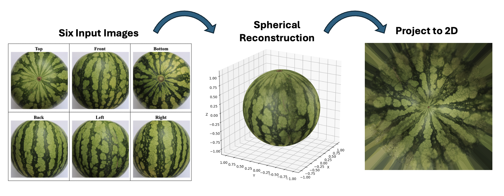
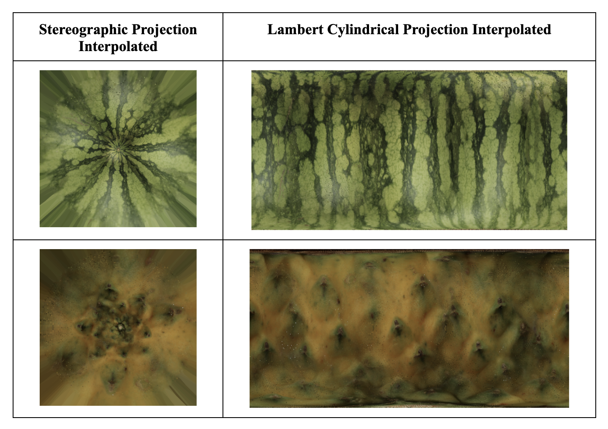

# Spherical Surface Reconstruction and Map Projection Pipeline

A computational pipeline for reconstructing approximately spherical surfaces from multi-view images and projecting them into 2D using map projections.

## Overview

This project implements a modular pipeline that takes six images of an object from different perspectives (front, back, left, right, top, bottom), reconstructs a textured spherical surface using inverse orthographic projection, and maps the result into 2D using projections such as stereographic (angle-preserving) and Lambert cylindrical (area-preserving).

The pipeline provides both a practical tool for surface visualization and a computational demonstration of differential geometry concepts such as coordinate charts, atlases, and projection-induced distortion.

---

## Features

- Multi-view spherical reconstruction
- Inverse orthographic projection
- Weighted blending of overlapping views
- Stereographic projection (conformal)
- Lambert cylindrical projection (equal-area)
- Interpolated 2D image rendering
- Modular object-oriented design

---

## Example Results

<h3 align="center">Pipeline Overview</h3>
<p align="center">
  
</p>

<h3 align="center">Projection Comparison</h3>
<p align="center">
  
</p>

<h3 align="center">Stereographic Projections of Various Objects</h3>
<p align="center">
  
</p>

These examples demonstrate:
- 3D spherical reconstruction from multi-view images  
- Stereographic projection (angle-preserving)  
- Lambert cylindrical projection (area-preserving)  
- Trade-offs between different map projections  

---

## Installation

```bash
git clone https://github.com/yourusername/spherical-surface-reconstruction.git
cd spherical-surface-reconstruction
pip install -r requirements.txt
